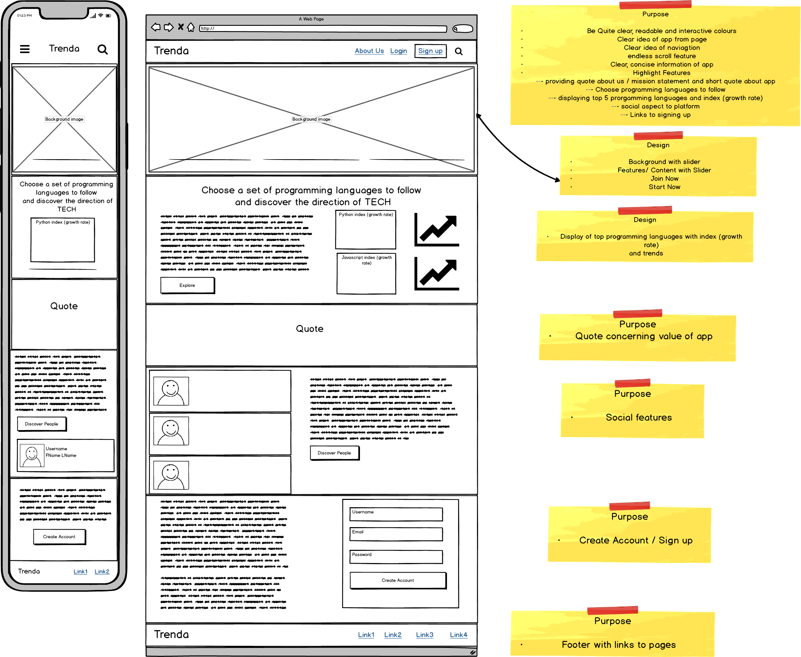
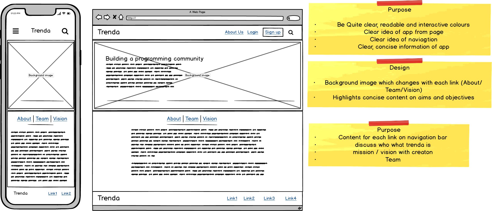
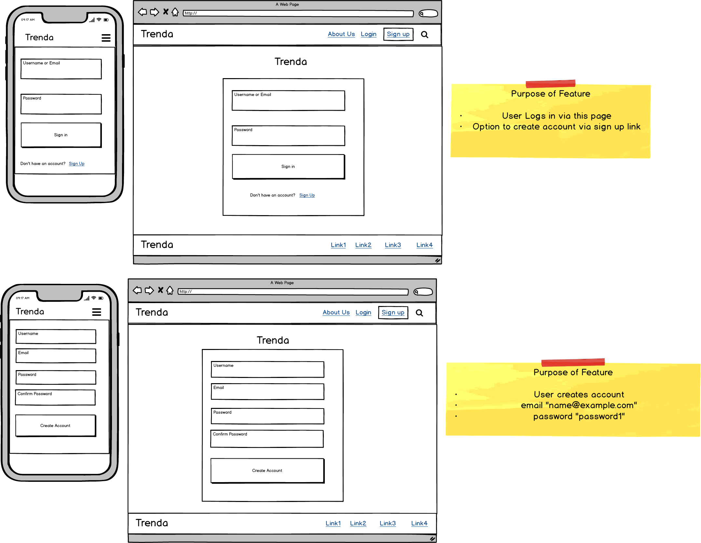
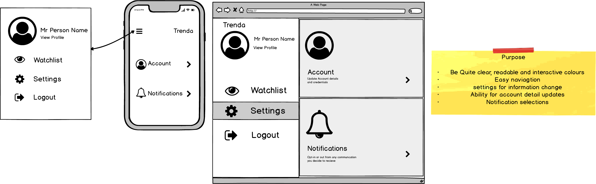
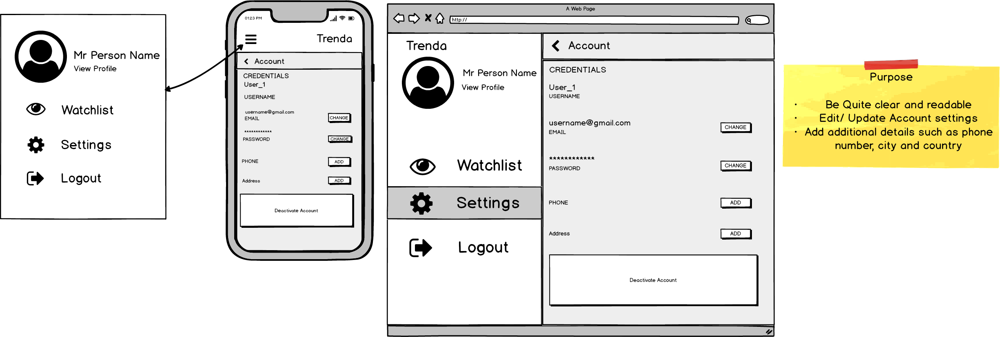
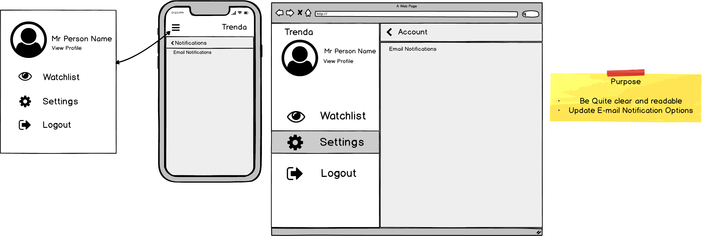

# Trenda

**Trello board progress tracker**

Link: https://trello.com/b/HxSpG3gM/trenda

### Overview
___________

Trenda is web application which used for following and keeping up to date with the job demand for popular programming languages. Trenda provides visuals graphs of trends and provides key insights on the fluctuation in demand for current programming languages. 
Users of the site can view up to date trends and can create and account where they can select specific programming languages to follow. Key insights and notifications are sent to users who have signed up during significant changes. 

### Local Install  Instructions
___________
- **Install Python 3.8**: apt-get install python3.8
- **Clone Repository**: git clone https://github.com/Folarin93/ccc-03-11.git
- **Change directory in app**: cd Trenda
- **Install venv**: pip install venv
- **Create virtual environment**: python3.8 -m venv venv
- **Activate virtual environment**: 
--- **Linux** source venv/bin/activate
--- **Windows** .\venv\Scripts\activate
- **Install dependencies**: pip install -r requirements.txt
- **Run app**: python src/main.py

### Wireframes
___________

##### Home Page (Landing Page)
The home page is first instance of Trenda for users not logged into the App. The Trenda home page should be clear, attractive and easy to navigate. The home page should give all visitors what the trenda is about. It will include the logo, concise, quotes, highlight each feature and offer the opportunities for the user to sign up.

##### About Page
The about page gives deeper insights to Trenda; displaying what Trenda is about, the team behind the app and the vision and values of the app. Essentially it provides the purpose and story behind it all. This is acessible to all visitors interested in using or learning about the web application. The Trenda about page should be clear, attractive and easy to navigate. The about page should also be concise and comprehensive; aiming to share the story,the people and mission in a very comprehensible and fluent manner.

##### Login and Sign-Up Page
Members will select the login tab and be swiftly navigated to the login page. The member will enter their correct details, select login and be directed to their profile/ dashboard page.

For users choosing to sign up and become members. They are redirected to a Signup form page where they can enter their credentials. Once validated they are then directed to their profile/dashboard page for them to setup it up and start using the application.

##### Profile Page

Here all the fun begins... In the users profile page, they should have a profile have a navigation bar to move between their watchlist, settings and profile details. Here, the user can update their username, password and profile picture. Their dashboard will be to the right of the page which displays all their current watchlist of programming languages and trend information. The user can also switch between created watchlists and sort according to preferences.

##### Settings Page
The settings page is available for the user to update account credentials, details and notification preferences.

###### Settings Account

In this page the User can update their account credentials such as name, email,password and additionally add their number, their city and country.

###### Settings Notifications
This offers user notification preferences which would be tailored to information to they would like to be notified about concerning trends and application.
This feature is a Work in Progress...

### CI/CD Pipeline
___________

The CI/CD pipeline was created using Github Actions. It is initiated once pushed to master It runs the latest stable Ubuntu, installs Python3.8 and Pip. 
The requirements.txt file is searched for and if found installs all dependencies included. The directory is changed into src and the tests are stored in the tests directory.